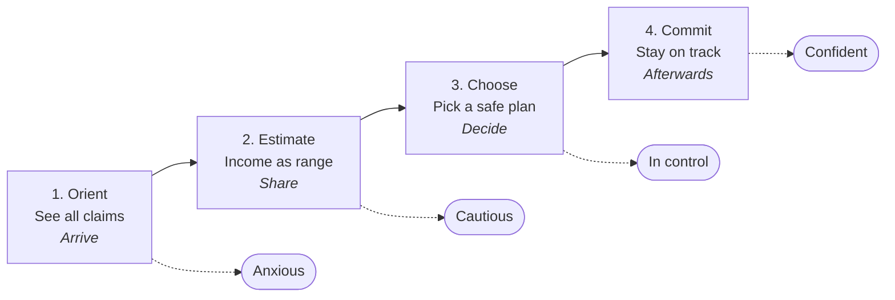

# Future-state journey map: a repayment plan Mara can keep

**Persona:** Mara, a consumer with limited time and uncertain income, dealing with a debt online.
**Goal:** Get a clear answer on whether a manageable payment plan is possible, and start one she can keep.
**Friction:** She is asked to commit to a monthly amount she cannot predict, and fears one wrong answer or one missed payment will make everything due at once. So she under-reports, abandons, or calls for reassurance.
**Strategy:** Consumers can set up instalment plans they can keep without the help of a customer agent.
**Value proposition:** A transparent, guided repayment journey that helps consumers choose sustainable instalment plans the first time, reducing unnecessary agent interactions while improving long-term recovery performance beyond SSR.

## One-page visual timeline

| | 1. Orient | 2. Estimate | 3. Choose | 4. Commit |
|---|---|---|---|---|
| **Moment** | Arrive | Share | Decide | Afterwards |
| **Internal state** | Anxious | Cautious | In control | Confident |

## The four stages

### 1. Orient
- **User Action:** Opens the reminder link and sees both claims together -> understands the full picture.
- **Internal State:** Anxious, short on time -> plain-language reasons for each question build trust.
- **Pain Point Addressed:** Explains why income is asked -> removes fear of hidden consequences.

### 2. Estimate
- **User Action:** Enters income as a range -> no single guess needed.
- **Internal State:** Cautious about wrong answers -> easy corrections replace under-reporting as self-protection.
- **Pain Point Addressed:** Accepts income variability -> removes the need to predict a monthly amount.

### 3. Choose
- **User Action:** Compares plans, sees the recommended affordable option -> picks without calling.
- **Internal State:** Weighing risk -> sees what happens if a payment is missed before committing.
- **Pain Point Addressed:** Shows consequences and support options upfront -> removes fear of everything becoming due.

### 4. Commit and stay on track
- **User Action:** Confirms plan; gets reminders and easy adjustment -> keeps the plan.
- **Internal State:** Relieved, in control -> trusts Riverty and keeps paying.
- **Pain Point Addressed:** Offers early adjustment or agent handoff with full context -> prevents missed payments, repeat questions.

## Three competitive advantages over the manual workaround

1. Answers consequence questions in-journey instead of Google -> Mara commits without leaving the portal.
2. Accepts variable income as a range -> plans match reality, so fewer missed payments.
3. Hands agents full context on escalation -> no repeated checks, faster resolution.

## Notes

- Moment labels (Arrive, Share, Decide, Afterwards) are qualitative; the brief gives no timings.
- SSR counts a plan as resolved when it is created. Pair it with a 60-day plan-kept rate to show the journey produces plans people can keep.
- The persona, workaround and funnel figures are fictional and based on the Riverty case study brief.
